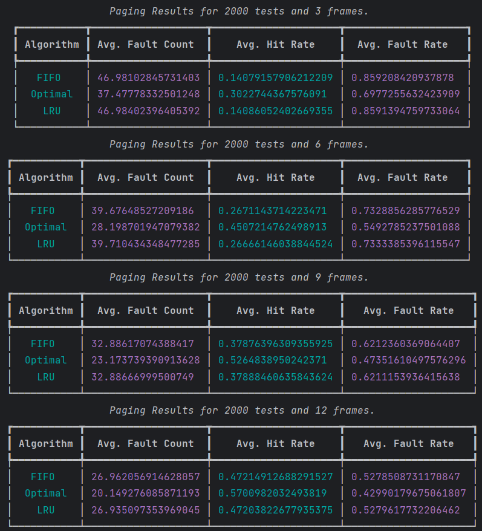

# CSB340_PyPageReplacement

## Setup

1. Create a virtual environment
```sh
python<version> -m venv <directory>

#example
python3.11 -m venv venv
```
2. Activate the virtual environment
```sh
#Windows
venv\Scripts\Activate.ps1

#macOS/Linux
source myvenv/bin/activate
```

3. Install requirements
```sh
pip install -r requirements.txt
```

## Run Tests

```sh
pytest
```

## Run Code

```sh
python main.py
```

In main.py there are global variables that can be configured to achieve different results

| Variable        | Description                                              |
|-----------------|----------------------------------------------------------|
| TEST_COUNT      | the number of iterations to run                          |
| MIN_PAGE_LENGTH | the minimum number of references in a page               |
| MAX_PAGE_LENGTH | the max number of references in a page                   |
| MAX_RANGE       | the upper bound of the range of allowed reference values |
| FRAMES          | a list of the number of frames to compare  [3, 4, 8]     |     

## Results



After several runs with different configurations. With this set up the FIFO and LRU algorithms perform very similar. I imagine that given specific test conditions that test might more realistically test these algorithms one might see larger differences. The Optimal algorithm outperformed the other two as expected. In some cases FIFO performed better than LRU by a fraction which I did not expect.
