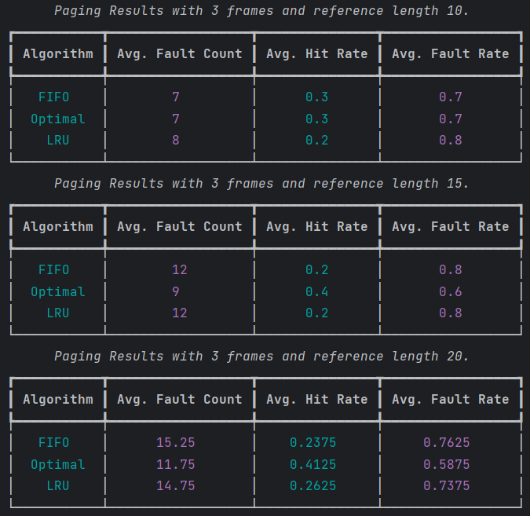
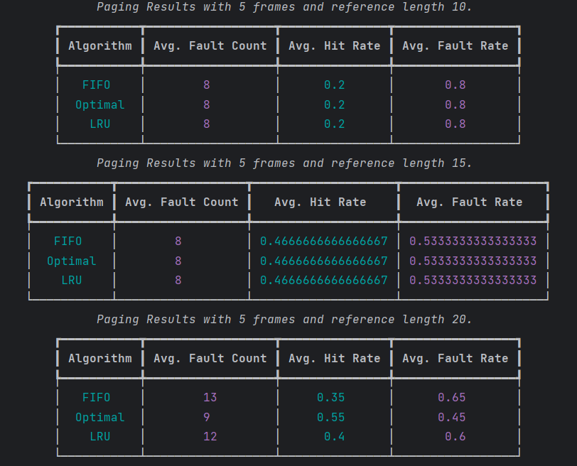
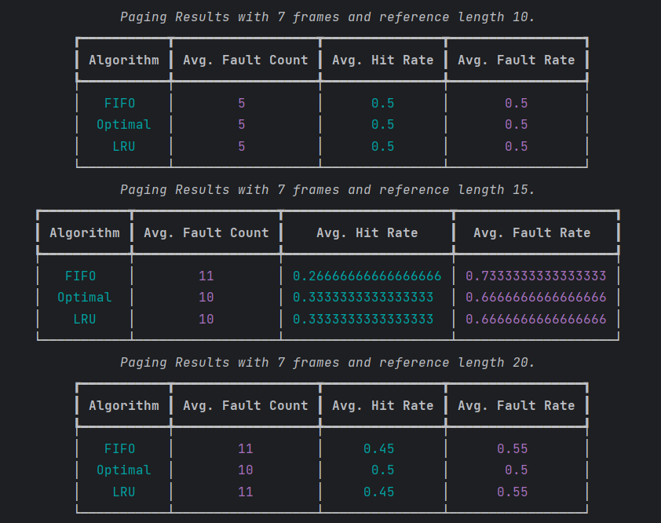

# CSB340_PyPageReplacement

## Setup

1. Create a virtual environment
```sh
python<version> -m venv <directory>

#example
python3.11 -m venv venv
```
2. Activate the virtual environment
```sh
#Windows
venv\Scripts\Activate.ps1

#macOS/Linux
source myvenv/bin/activate
```

3. Install requirements
```sh
pip install -r requirements.txt
```

## Run Tests

```sh
pytest
```

## Run Code

```sh
python main.py
```

In main.py there are global variables that can be configured to achieve different results

| Variable        | Description                               |
|-----------------|-------------------------------------------|
| PAGE_LENGTHS    | A list of different pages lengths.        |
| MAX_RANGE       | The upper bound for the reference values  |
| FRAMES          | A list of the number of frames to compare |

### Big O

All runtimes for the algorithms are O(n) as implemented here. FIFO iterates through all the items once and maintains a queue which has O(1) pop and append. Optimal and LRU must also iterate through all the items. Looping is done on the cache but the cache size is known so does not add to runtime. They also maintain dictionaries which have constant lookup time for comparisons.

## Results

If we agree that Optimal performs the best all the time then we can say that the comparison is really between FIFO and LRU. Optimal shows us how well the other two perform in comparison to it.



The results from the algorithms with 3 frames shows that at length 10 FIFO did very well and tied with the Optimal algorithm. When the reference length increased to 15 FIFO and LRU tied. At length 20, LRU outperformed FIFO. At 3 frames it seems that the lower reference string length leaned towards FIFO while the longer string favors LRU.



The results with 5 frames were different from the previous results with 3 frames. At both length 10 and length 15 all algorithms tied. At 20 FIFO and LRU increased their average fault counts. FIFO had the highest of the three. Average hit rates and average fault rates followed that pattern



Interestingly at 7 frames with a string length of 10 we saw the lowest mean fault count numbers and all algorithms tied in metrics. At length 15 FIFO performed the worst with LRU still tied with Optimal. At length 20 the mean faults counts almost the same but LRU dropped by one unit and tied with FIFO. Overall, the algorithms seemed to perform the best with 7 frames. That is, FIFO and LRU were equal or very close to the performance of the Optimal algorithm.

## Conclusion and Speculation

Within this experiment it seemed that with more frames there was a higher probability of an item already being present which would decrease the fault count. This is true because in the experiment I limited the numbers being generated to single digit integers. This decreases the amount of variation in each reference string. I imagine if we increase the variation the numbers would be entirely different. I speculate that there is a correlation between number of frames and variety of reference string items, not just the length alone. The length obviously creates more opportunities for hits and faults which may skew the results. But again, if the variety is fairly low then the number of frames should be more important that length.